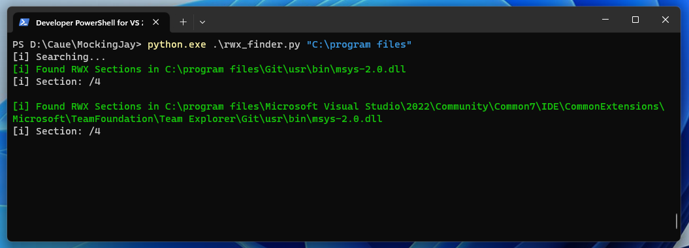
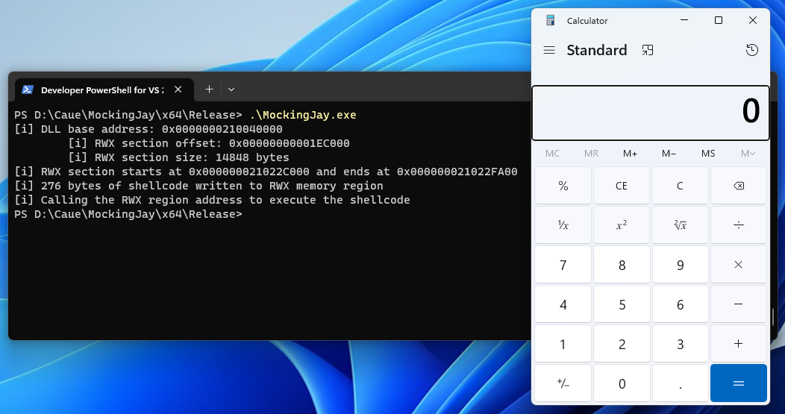

# Mockingjay
Mockingjay process self injection POC.

Technique originally published by [Security Joes](https://www.securityjoes.com/post/process-mockingjay-echoing-rwx-in-userland-to-achieve-code-execution) that takes advantage of RWX sections in DLLs to allocate and execute code.  

# POC
Use the `rwx_finder.py` to find vulnerable DLLs with RWX sections:

Compile and run the solution:

